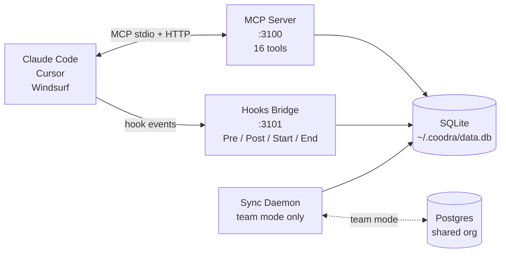
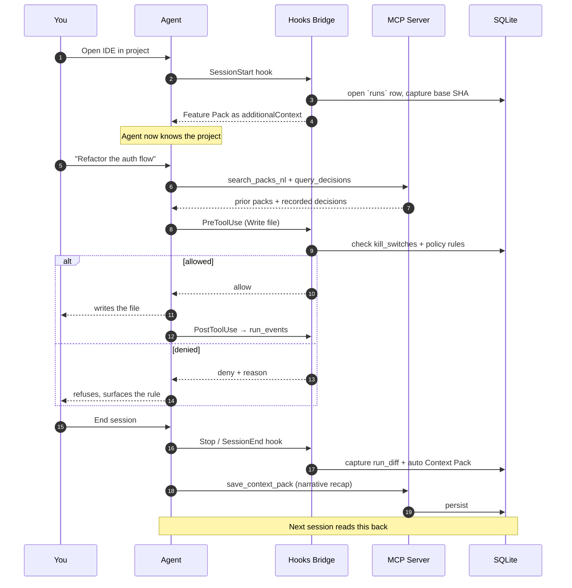

<div align="center">

# Coodra


[](https://github.com/Abishai95141/Coodra/actions/workflows/ci.yml)
[](https://www.npmjs.com/package/@coodra/cli)
[](LICENSE)
[](.nvmrc)

**Memory, project context, and policy guardrails for AI coding agents.**
**Works with Claude Code, Cursor, and Windsurf — local-first, MIT.**

</div>

---

Your AI agent forgets what it decided last session. It re-learns your project conventions every single time. It writes to files it shouldn't. Coodra fixes all three — by injecting **architectural context** at session start, recording **durable memory** as the session runs, and enforcing **policy rules** before every write. One command to install. Runs entirely on your laptop.

```bash
npm i -g @coodra/cli@beta && coodra init && coodra start
```

Then open Claude Code (or Cursor / Windsurf) in your project. The agent picks up the Feature Pack on its very first turn. That's it.

---

## What your agent gets

Three primitives, each delivered at the right moment in the session:

| Primitive | When | What it carries |
|---|---|---|
| **Feature Pack** | Injected at session start (push) | Module blueprint: spec, conventions, permitted files, gotchas — authored in `docs/feature-packs/<slug>/` |
| **Context Pack** | Saved at session end; queryable from any future session | Durable record of decisions, file changes, test results, open TODOs |
| **Policy** | Evaluated before every write or shell command | Project-scoped allow / ask / deny rules; fail-open under load; audit-logged forever |

Plus an **on-demand skill layer** (Anthropic Skills pattern) the agent pulls only when a user prompt matches a registered trigger. You author skills as markdown; Coodra indexes the frontmatter and the agent decides which to load.

---

## How it works



Two long-running processes do all the local work. An optional third (the sync daemon) mirrors selected rows into a Postgres database **your team owns**, with append-only semantics on the hot tables. The hot path always stays on your laptop — sync is asynchronous.

---

## A session, end to end



---

## Two modes

| | Solo | Team |
|---|---|---|
| Default after `coodra init` | yes | opt-in via `coodra team setup` |
| Network footprint | none — fully offline | only sync-daemon ↔ your Postgres |
| Identity | local, single-user (`__solo__`) | Clerk JWT, org-scoped |
| Primary store | `~/.coodra/data.db` (SQLite + sqlite-vec) | same SQLite, plus Postgres mirror |
| Sharing | none | decisions, packs, runs sync across teammate laptops |
| Cost | $0 | bring your own Postgres (Supabase / fly.io / self-host) + Clerk |
| Auth chain | solo bypass | bypass → `X-Local-Hook-Secret` → Clerk JWT |
| Daemons | 2 (mcp-server, hooks-bridge) | 3 (+ sync-daemon) |

Switch any time: `coodra team setup` (admin, once per team) → `coodra invite <email>` (admin) → `coodra team join <invite-url>` (teammate).

---

## What you'll see in your first hour

1. **At session start**, the agent's first response cites your project's conventions without you teaching it — that's the Feature Pack arriving as `additionalContext`.
2. **Start a new session minutes later** and the agent already knows the decisions it made earlier. That's `query_decisions` + `search_packs_nl` reading what the previous session wrote.
3. **In team mode**, a teammate's decision from yesterday shows up in your session today. The sync-daemon pulled it from your shared Postgres while you weren't looking.

---

## The 16 MCP tools

Grouped by intent. Every tool ships a five-part description so the agent's planner knows exactly when to call it (and when not to).

| Group | Tools |
|---|---|
| **Identity** | `get_run_id` · `ping` |
| **Architectural context** | `get_feature_pack` · `list_features` · `get_feature` · `get_feature_file` · `query_codebase_graph` |
| **Cross-session memory** | `save_context_pack` · `list_context_packs` · `read_context_pack` · `search_packs_nl` |
| **Decisions** | `record_decision` · `query_decisions` |
| **Policy + runs** | `check_policy` · `query_run_history` · `query_run_diff` |

`check_policy` is load-bearing for guardrails. `record_decision` + `save_context_pack` are load-bearing for memory. `get_feature_pack` is load-bearing for context.

---

## What ships

```
@coodra/cli@beta            single npm install — everything bundled
├── mcp-server              TS · 16 MCP tools · stdio + HTTP transport
├── hooks-bridge            TS · Hono on 127.0.0.1:3101 · 5 hook events
├── sync-daemon             TS · outbox push + cloud→local puller (team only)
├── web-v2                  Next.js 15 admin UI on :3001 (audit log, policies, packs)
└── runtime/                drizzle migrations + bundled native modules
```

Single tarball via esbuild — `npm i -g @coodra/cli` is the only install step. Native modules (`better-sqlite3`, `sqlite-vec`) stay external so they install correctly per platform.

---

## Repository layout

```
apps/
  mcp-server/    Coodra MCP server (16 tools)
  hooks-bridge/  Claude Code / Cursor / Windsurf hook receiver
  sync-daemon/   Team-mode cloud sync (push + pull)
  web-v2/        Admin + audit-trail UI (Next.js 15)

packages/
  cli/           The @coodra/cli npm package
  db/            Drizzle schema + 17 SQLite / 19 Postgres migrations
  policy/        Pure policy-decision engine (cockatiel timeout + breaker, fail-open)
  shared/        Cross-cutting Zod schemas, auth (Clerk + solo bypass), hook adapters

docs/
  feature-packs/   Per-module specs (spec.md / implementation.md / techstack.md)
  context-packs/   Permanent records of completed modules
  DEVELOPMENT.md   Local dev loop
  deploy/          Self-host stack docs (deploy/compose.yaml ships 5 services)

essentialsforclaude/   Standing agent rules — auto-loaded by CLAUDE.md
```

Full architectural spec: [`system-architecture.md`](system-architecture.md) (25 sections, source of truth). Navigation map: [`essentialsforclaude/references/architecture-map.md`](essentialsforclaude/references/architecture-map.md).

---

## Status

**`@coodra/cli@0.2.0-beta.3`** — public beta.

Stable: MCP server, hooks bridge, CLI, policy engine, audit log, solo mode, team mode (Clerk + Postgres sync), kill-switch primitives, Run Diff capture, knowledge layer (Feature Packs + on-demand Features).

In progress: `web-v2` admin UI polish, knowledge-layer cloud-sync conflict edge cases, multi-org isolation tightening (Phase G+1).

Coverage: ~180 unit-test files across 9 workspaces, plus an e2e suite that boots real Postgres via testcontainers and exercises the full session lifecycle in CI on every PR. Migration lock prevents Drizzle drift on hand-written SQL blocks (sqlite-vec virtual table, pgvector HNSW index).

---

## Get help

- **Bug?** [Open an issue](https://github.com/Abishai95141/Coodra/issues) — include `coodra doctor --json` plus your OS / Node version.
- **Security concern?** Email [abishai95141@gmail.com](mailto:abishai95141@gmail.com). Please do not file a public issue.
- **Architecture question?** Start at [`system-architecture.md`](system-architecture.md). It is long but indexed.

---

## Contributing

PRs welcome. Read [`CONTRIBUTING.md`](CONTRIBUTING.md) for the dev loop, commit conventions, and the project-specific guardrails (no shallow proxies, no `any`, idempotency at every write, schema changes only through Drizzle migrations).

If you are an **AI coding agent** reading this: every session in this repo auto-loads [`CLAUDE.md`](CLAUDE.md). Follow the trigger contract in [`essentialsforclaude/05-agent-trigger-contract.md`](essentialsforclaude/05-agent-trigger-contract.md), record decisions as you make them, save your Context Pack at session end.

---

## License

MIT — see [`LICENSE`](LICENSE).

<div align="center">

—

**Coodra is the layer between your AI coding agents and your codebase.**
Memory. Context. Policy. Local-first.

</div>
