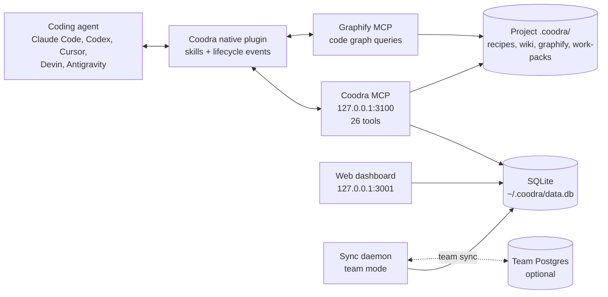
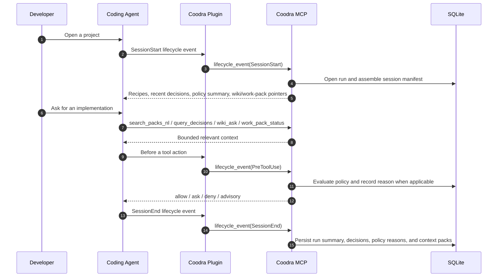

<div align="center">

# Coodra


[](https://github.com/matrix-maven/Coodra/actions/workflows/ci.yml)
[](https://www.npmjs.com/package/@coodra/cli)
[](LICENSE)
[](.nvmrc)

**Supercharge your coding agent.**

Plugin-native memory, Work Packs, Deep Wiki, Graphify code graph, and policy governance for AI coding agents.

</div>

---

Coodra gives AI coding agents durable project context instead of asking every
session to rediscover the same architecture, decisions, tickets, and rules. It
runs local-first, ships as one npm CLI, and wires into native agent plugin
surfaces for Claude Code, Codex, Cursor, Devin, and Antigravity.

Use it when you want your coding agent to start with the right repo context,
retrieve prior decisions, work from issue-shaped Work Packs, query a structural
code graph, author a Deep Wiki, and check policy before risky actions.

## Install

```bash
npm i -g @coodra/cli
coodra install
coodra agent add codex     # or: claude, cursor, devin, antigravity, all, detected
coodra init
coodra start
coodra doctor
```

pnpm users should allow the native SQLite build:

```bash
pnpm add -g @coodra/cli --allow-build=better-sqlite3
```

`coodra install` prepares the machine runtime under `~/.coodra/`, including the
local SQLite store, logs, daemon state, the shared Graphify MCP runtime, and the
machine manifest. `coodra agent add <agent>` installs Coodra as a native agent
plugin with bundled skills, lifecycle hooks, the Coodra MCP entry, and the
managed Graphify MCP entry. `coodra init` is project-local: it registers the
repo and creates `.coodra/{config.json,manifest.json,recipes/,graphify/,wiki/,work-packs/}`.

`coodra start` launches the Coodra MCP server on port 3100, the web dashboard on
port 3001, and the sync daemon when the machine is in team mode.

## Core Concepts

| Concept | Purpose |
|---|---|
| Agent Recipe | On-demand task guidance the agent can load from `.coodra/recipes/<slug>/`. Recipes keep reusable workflows close to the repo. |
| Memory | Durable context saved as Context Packs, decisions, run history, and surfaced memory-access telemetry. Session start receives a bounded manifest; prompt-time retrieval happens through MCP tools such as `search_packs_nl`, `query_decisions`, and `wiki_ask`. |
| Work Pack | Issue-shaped execution context under `.coodra/work-packs/`. Work Packs can be created manually or imported from Jira/Linear-style program-management systems by the agent using those systems' native MCP tools, then persisted through Coodra's `work_pack_*` tools. |
| Deep Wiki | A codebase wiki authored by the coding agent from source evidence, Graphify, and Coodra context. Canonical wiki content is saved through MCP and mirrored under `.coodra/wiki/` for review/export. |
| Graphify Code Graph | Structural graph context in `.coodra/graphify/out/graph.json`, served by Graphify's own MCP server and managed by Coodra plugin wiring. |
| Policy | DB-backed allow, ask, deny, and advisory controls. Policy checks are recorded with reasons so governance decisions are auditable. |
| Lifecycle Events | Native plugin events such as session start, prompt submit, tool use, and session end. These events let Coodra open runs, surface context, record activity, and enforce policy without project-local hook glue. |

## How It Works


```mermaid
flowchart LR
  Agent["Coding agent<br/>Claude Code, Codex, Cursor,<br/>Devin, Antigravity"]
  Plugin["Coodra native plugin<br/>skills + lifecycle events"]
  MCP["Coodra MCP<br/>127.0.0.1:3100<br/>26 tools"]
  Graphify["Graphify MCP<br/>code graph queries"]
  Web["Web dashboard<br/>127.0.0.1:3001"]
  Sync["Sync daemon<br/>team mode"]
  Local[("SQLite<br/>~/.coodra/data.db")]
  Team[("Team Postgres<br/>optional")]
  Repo[("Project .coodra/<br/>recipes, wiki, graphify, work-packs")]

  Agent <--> Plugin
  Plugin <--> MCP
  Plugin <--> Graphify
  MCP --> Local
  MCP --> Repo
  Graphify --> Repo
  Web --> Local
  Sync --> Local
  Sync <-.team sync.-> Team
```


```mermaid
sequenceDiagram
  autonumber
  participant U as Developer
  participant A as Coding Agent
  participant P as Coodra Plugin
  participant M as Coodra MCP
  participant D as SQLite

  U->>A: Open a project
  A->>P: SessionStart lifecycle event
  P->>M: lifecycle_event(SessionStart)
  M->>D: Open run and assemble session manifest
  M-->>A: Recipes, recent decisions, policy summary, wiki/work-pack pointers

  U->>A: Ask for an implementation
  A->>M: search_packs_nl / query_decisions / wiki_ask / work_pack_status
  M-->>A: Bounded relevant context

  A->>P: Before a tool action
  P->>M: lifecycle_event(PreToolUse)
  M->>D: Evaluate policy and record reason when applicable
  M-->>A: allow / ask / deny / advisory

  A->>P: SessionEnd lifecycle event
  P->>M: lifecycle_event(SessionEnd)
  M->>D: Persist run summary, decisions, policy reasons, and context packs
```

### Memory Model

Coodra memory is not a single note file. It is a set of DB-backed records tied
to projects, runs, agents, and retrieved artifacts:

- `record_decision` captures durable architectural or product decisions.
- `save_context_pack` stores session recaps, implementation notes, test results,
  and follow-ups.
- `lifecycle_event(SessionStart)` opens a run and surfaces the session-start
  manifest, including bounded recent context.
- `lifecycle_event(UserPromptSubmit)` can surface prompt-relevant context without
  writing a push row.
- Memory-access events track retrieval and surfacing where the runtime records
  them, including session-start manifest and policy-reason pushes.
- Team mode mirrors selected append-only rows through the sync daemon so shared
  decisions, packs, runs, wiki pages, and Work Packs can move across laptops.

The agent pulls memory when it needs more context and Coodra pushes bounded
context when lifecycle events make it useful.

## MCP Tools

Coodra exposes 26 MCP tools:

| Group | Tools |
|---|---|
| Identity and lifecycle | `ping`, `get_run_id`, `lifecycle_event` |
| Recipes | `list_recipes`, `get_recipe`, `get_recipe_file` |
| Memory | `save_context_pack`, `search_packs_nl`, `list_context_packs`, `read_context_pack` |
| Decisions and runs | `record_decision`, `query_decisions`, `query_decisions_by_file`, `query_run_history`, `query_run_diff` |
| Policy | `check_policy` |
| Links and collaboration | `link_run_to_issue`, `link_run_to_pr`, `prepare_jira_comment` |
| Deep Wiki | `wiki_save_structure`, `wiki_save_page`, `wiki_status`, `wiki_ask` |
| Work Packs | `work_pack_upsert`, `work_pack_update`, `work_pack_status` |

Graphify is intentionally separate. It is an independent open-source project
that Coodra can install and manage locally as a Graphify MCP server. Coodra owns
the wiring and points Graphify at the current project's
`.coodra/graphify/out/graph.json`; Graphify owns the graph engine.

## CLI Surface

Common commands:

| Command | Purpose |
|---|---|
| `coodra install` | Install or repair machine-level runtime state. |
| `coodra agent add <agent>` | Wire Coodra as a native plugin for one or more agents. |
| `coodra init` | Register the current project and create project-local `.coodra/` state. |
| `coodra start` / `coodra stop` / `coodra status` | Run and inspect local services. |
| `coodra doctor --full` | Run runtime, lifecycle, policy, outbox, and service health checks. |
| `coodra files status` / `coodra files clean` | Inspect or clean generated project files recorded in `.coodra/manifest.json`. |
| `coodra metrics` / `coodra roi` | Show knowledge reuse, governance, and modeled value KPIs. |
| `coodra graphify build/status/open/clean` | Build and inspect the code graph artifacts. |
| `coodra wiki build/status/list/open/ask/clean` | Create, inspect, open, query, or remove Deep Wiki content. |
| `coodra work import/status/show` | Prepare and inspect Work Packs. |
| `coodra policy ...` | Manage local policy rules and governance catalogs. |
| `coodra project ...` / `coodra run ...` | Inspect project and run records. |
| `coodra login`, `coodra invite`, `coodra team ...` | Team-mode identity, invites, sync, and setup flows. |

## Work Packs

Work Packs are the bridge between program management and agent execution. A Work
Pack can hold the issue goal, acceptance criteria, affected files, dependency
notes, related issues, implementation plan, and execution status. For Jira or
Linear, the coding agent uses the provider's own native MCP tools to fetch and
sync issue data, then writes the Coodra-side execution context through
`work_pack_upsert`, `work_pack_update`, and `work_pack_status`.

That keeps Coodra provider-neutral: Jira and Linear remain the source of truth
for program management, while Coodra stores the agent-ready execution context
needed inside the repo.

## Modes

| | Solo | Team |
|---|---|---|
| Default after `coodra init` | yes | opt-in |
| Network footprint | none | sync daemon talks to your Postgres and web identity provider |
| Identity | local solo user | Clerk-backed user/org identity |
| Primary store | SQLite under `~/.coodra/` | SQLite plus Postgres mirror |
| Sharing | local laptop only | selected memory, wiki, policy, run, and Work Pack records sync across teammates |
| Runtime | MCP server + web dashboard | MCP server + web dashboard + sync daemon |

## Repository Layout

```text
apps/
  mcp-server/    Coodra MCP server and lifecycle-event runtime
  sync-daemon/   Team-mode outbox push and cloud-to-local pull
  web-v2/        Admin, audit, policy, memory, and wiki UI

packages/
  cli/           @coodra/cli npm package
  db/            Drizzle schema and migrations
  policy/        Policy decision engine
  shared/        Shared schemas, auth, and runtime utilities

docs/
  index.html     Public developer documentation source
  DEVELOPMENT.md Local development loop
  deploy/        Self-host deployment notes
  brand/         Coodra brand assets

.coodra/
  graphify/      Generated code graph artifacts
  wiki/          Wiki grounding and Markdown mirror
  work-packs/    Local Work Pack artifacts
```

Full developer documentation lives in [`docs/index.html`](docs/index.html) and
is published at <https://matrix-maven.github.io/Coodra/docs/>.

## Build And Publish From Source

The CLI ships as one npm tarball. `dist/` is git-ignored, so build from a clean
clone when publishing.

```bash
git clone https://github.com/matrix-maven/Coodra.git
cd Coodra
corepack enable
pnpm install
cd packages/cli
npm publish
```

`npm publish` runs the workspace build and bundle verification before upload.
Use `npm publish --dry-run` to rehearse.

## Project Status

Latest package: `@coodra/cli@0.5.11`.

Stable surfaces include native plugin wiring, lifecycle events, Coodra MCP,
Graphify MCP management, Deep Wiki, Work Packs, DB-backed memory, policy
governance, solo mode, and team-mode sync.

## Contributing And Security

- Contributions: [`CONTRIBUTING.md`](CONTRIBUTING.md)
- Support: [`SUPPORT.md`](SUPPORT.md)
- Security reports: [`SECURITY.md`](SECURITY.md)
- Code of conduct: [`CODE_OF_CONDUCT.md`](CODE_OF_CONDUCT.md)
- Third-party notices: [`NOTICE`](NOTICE)

## License

MIT License. Copyright (c) 2026 Matrix Maven.
