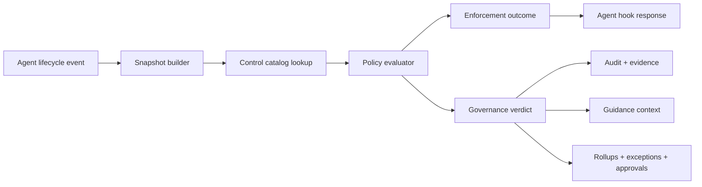

# COOD-34 Policy Governance Redesign

Status: draft design, 2026-08-09

Scope: redesign Coodra policy and permissioning so COOD-34 can operationalize the agent-observable subset of the VXI Cloud IAM control catalog as non-blocking AI governance, while keeping existing hard safety controls for secrets and agent self-protection.

## Source Inputs

- COOD-34: "Operationalize VXI Cloud IAM Control Catalog as non-blocking policy guidance."
- Microsoft Agent Governance Toolkit, especially Agent Control Specification: lifecycle intervention points, deterministic policy runtime, evidence-bearing verdicts, tool catalog labels, annotators, approval configuration, and audit.
- Current Coodra implementation:
  - `packages/policy/src/types.ts`: runtime decision type is `allow | deny | ask`.
  - `packages/policy/src/policy.ts`: first-match-wins, tool-oriented evaluator, fail-open DB/cache fuse, async audit write helper.
  - `packages/db/src/schema/sqlite.ts`: policy catalog has versions, exceptions, decision audit fields, control metadata, and kill switches.
  - `packages/shared/src/policy-evaluators.ts`: UI-facing evaluator taxonomy already names lifecycle governance verbs, but storage collapses them.
  - `apps/hooks-bridge/src/handlers/pre-tool-use.ts`: only pre-tool calls are evaluated through DB policy.
  - `apps/hooks-bridge/src/handlers/config-change.ts`: config projection is attested separately from DB policy rules.
  - `packages/db/src/ensure-default-policy.ts`: fresh installs now soften `.git/**` and `node_modules/**` from `deny` to `ask`; `.env` and agent-control self-protection remain `deny`.

## Problem

Coodra currently has two ideas partially fused together:

1. Permissioning: synchronous enforcement at agent hook time, answering "may this agent perform this action?"
2. Governance: advisory controls, control ownership, evidence, review cadence, control status, and audit rollups.

That fusion makes the product feel too restrictive because advisory controls are forced into `allow | ask | deny`. Today the web UI exposes `record`, `flag`, `warn`, `block`, and `pass`, but `policyDecisionForStorage()` maps them into the enforcement triad. This means guidance can become interruption, and lifecycle/process controls can look like tool permissions even when no tool-call hook can prove them.

COOD-34 needs the opposite: governance controls must be visible and auditable without becoming gates.

## Design Principle

Split "can the agent continue?" from "what governance signal should be recorded?"

Every policy evaluation should return two independent outputs:

- Enforcement outcome: `allow`, `ask`, or `deny`.
- Governance verdict: `pass`, `record`, `advise`, `warn`, `confirm`, `escalate`, or `block`.

Only the enforcement outcome may interrupt a tool call. Governance verdicts drive context, audit, evidence, dashboards, approvals, and follow-up work.

Policy matching also needs a third, orthogonal dimension: capability context. A rule must be able to say "this applies only when the current run is in deployment mode" without overloading enforcement or governance verdicts.

## Target Architecture

### 1. Control Catalog

Add a first-class control catalog instead of representing every governance item as a tool-call rule. For COOD-34 v1, build only the native advisory track. The broader VXI catalog can remain imported reference data for future evidence workflows, but it should not drive implementation scope.

Suggested tables:

- `controls`
  - `id`, `org_id`, `control_id`, `domain`, `subdomain`, `title`, `description`, `priority`, `owner`, `frequency`, `source`, `status`, `track`, `created_at`, `updated_at`
  - `track`: `agent_observable | process_attested | external_evidence`
- `control_policy_links`
  - `id`, `control_id`, `policy_id`, `rule_id`, `intervention_point`, `created_at`
- `control_attestations`
  - `id`, `control_id`, `project_id`, `work_pack_id`, `status`, `evidence_uri`, `evidence_summary`, `attested_by_user_id`, `attested_at`, `valid_until`, `created_at`

This preserves the full catalog model, while keeping COOD-34 v1 intentionally narrow:

- Track A, agent-observable controls: controls that can fire from hooks, e.g. destructive shell, cloud exposure, secret access, direct deploy.
- Track B, process controls: controls that need human or pipeline attestation, e.g. kickoff review, support model, access certification.
- Track C, external-owner controls: controls that belong to IAM, SIEM, ITSM, CMDB, billing, or cloud-provider inventory systems. Coodra stores evidence links and reminders only.

#### VXI catalog relevance for Coodra

The VXI control catalog was written for human and enterprise process enforcement. Coodra should import all 66 controls as governance metadata, but it should not treat all 66 as native agent policies.

Use three relevance levels:

- `Native advisory`: Coodra can observe meaningful signals from repo files, tool calls, work packs, policy decisions, generated artifacts, or CI/security evidence. These can become advisory rules and audit events.
- `Evidence/attestation`: Coodra can track the checklist item, owner, evidence, expiry, and review cadence, but a human, CI system, cloud platform, or enterprise workflow owns the truth.
- `External-owner`: Coodra should only store links or attestations from the system of record. It should not claim enforcement or satisfaction from agent activity.

Initial classification:

| Control | Coodra fit | Treatment |
| --- | --- | --- |
| VXI-GOV-001 | Evidence/attestation | Track kickoff participants and evidence; do not infer attendance from code work. |
| VXI-GOV-002 | Evidence/attestation | Store owner/cost/repo metadata as project attributes; require human or source-system attestation. |
| VXI-GOV-003 | Evidence/attestation | Represent readiness approvals as milestone evidence, not tool-call gates. |
| VXI-GOV-004 | Evidence/attestation | Link the environment standard and record deviations. |
| VXI-GOV-005 | Native advisory | Map to Coodra exceptions/grants: scoped, time-bound, risk-accepted, reviewed. |
| VXI-GOV-006 | Evidence/attestation | Track separation-of-duties approvals; Coodra cannot verify enterprise approver independence alone. |
| VXI-GOV-007 | Evidence/attestation | Link risks to controls/work packs; risk register remains external unless integrated. |
| VXI-GOV-008 | Native advisory | Use Coodra audit events, decisions, context packs, and control attestations as evidence inventory. |
| VXI-IAM-001 | External-owner | Environment role separation belongs to IdP/cloud IAM; Coodra stores evidence only. |
| VXI-IAM-002 | External-owner | Standing admin detection requires IAM inventory; Coodra can advise if agent asks for broad credentials. |
| VXI-IAM-003 | External-owner | Default developer access posture is an IAM policy matter, not an agent hook decision. |
| VXI-IAM-004 | Evidence/attestation | JIT access can be represented as a capability/grant when Coodra mediates the action; final approval source is external. |
| VXI-IAM-005 | Evidence/attestation | Use grant expiry/max duration in Coodra, but enterprise IAM session duration remains external. |
| VXI-IAM-006 | External-owner | Privileged action monitoring is SIEM/cloud audit owned; Coodra can emit supplemental agent audit. |
| VXI-IAM-007 | External-owner | Break-glass governance is external; Coodra only records evidence and links. |
| VXI-IAM-008 | External-owner | Access certification depends on IAM rosters and manager review. |
| VXI-IAM-009 | Evidence/attestation | Coodra can flag committed static credentials and service-account-like secrets, but workload identity proof is external. |
| VXI-IAM-010 | Evidence/attestation | Coodra can protect `.env` and secret reads/writes; vault/IAM authorization is external evidence. |
| VXI-CLD-001 | Native advisory | Flag cloud resource creation outside IaC paths or without planned IaC artifacts. |
| VXI-CLD-002 | Native advisory | Warn on IaC changes lacking review evidence, branch hygiene, or linked work pack. |
| VXI-CLD-003 | Evidence/attestation | Track dev environment request package as checklist/evidence. |
| VXI-CLD-004 | Evidence/attestation | Track expiration metadata; actual teardown requires cloud integration. |
| VXI-CLD-005 | Evidence/attestation | Advise against unapproved services if catalog metadata exists; authoritative catalog is external. |
| VXI-CLD-006 | Native advisory | Ask/advise on API key creation commands and secret material handling. |
| VXI-CLD-007 | Native advisory | Warn on public exposure patterns in IaC, config, firewall, ingress, or deployment commands. |
| VXI-CLD-008 | Native advisory | Check required tag patterns in IaC/config where visible. |
| VXI-CLD-009 | Evidence/attestation | Track budget evidence; anomaly detection is billing/cloud-platform owned. |
| VXI-CLD-010 | Native advisory | Use repo/IaC drift signals when available; provider drift requires connector or pipeline evidence. |
| VXI-ARC-001 | Evidence/attestation | Store architecture review evidence before production promotion. |
| VXI-ARC-002 | Evidence/attestation | Store security architecture review signoff/evidence. |
| VXI-ARC-003 | Evidence/attestation | Track threat model artifact and expiry; Coodra may help generate/review it. |
| VXI-ARC-004 | Evidence/attestation | Record data classification claims; do not infer full handling compliance from code alone. |
| VXI-ARC-005 | Evidence/attestation | Network approval belongs to architecture/cloud governance. |
| VXI-ARC-006 | Evidence/attestation | Resiliency design can be documented in Coodra; runtime validation is external. |
| VXI-ARC-007 | Evidence/attestation | Coodra/Graphify can assist dependency maps, but business/system dependency truth may need owner attestation. |
| VXI-ARC-008 | Native advisory | Use Coodra decisions/ADRs/context packs for architecture decision capture. |
| VXI-SEC-001 | Native advisory | Check work packs/backlog for security requirements on security-sensitive changes. |
| VXI-SEC-002 | Native advisory | Record SAST evidence from local or CI runs when available; otherwise create an evidence gap. |
| VXI-SEC-003 | Native advisory | Record SCA/license evidence from package scans and dependency diffs. |
| VXI-SEC-004 | Evidence/attestation | Container/image scan proof usually comes from CI/registry scanners. |
| VXI-SEC-005 | Evidence/attestation | DAST/API testing proof belongs to pipeline/security tooling; Coodra tracks evidence. |
| VXI-SEC-006 | Evidence/attestation | Pen-test scope and results are human/security-team owned artifacts. |
| VXI-SEC-007 | Evidence/attestation | Coodra can track findings against SLAs, but scanner/source-of-truth status is external. |
| VXI-SEC-008 | Native advisory | Secret detection and `.env` protection are direct Coodra policy controls. |
| VXI-SEC-009 | Native advisory | Run or record IaC/cloud-policy checks where tooling exists; otherwise surface missing evidence. |
| VXI-SEC-010 | Evidence/attestation | Security signoff is an approval artifact, not an automatic agent decision. |
| VXI-OPS-001 | Evidence/attestation | Monitoring requirements are checklist/evidence items before go-live. |
| VXI-OPS-002 | External-owner | Centralized logging is platform/SIEM owned; Coodra only links evidence. |
| VXI-OPS-003 | Evidence/attestation | Alert ownership can be tracked as metadata/evidence. |
| VXI-OPS-004 | Evidence/attestation | Coodra can generate/check runbooks, but operational acceptance is attested. |
| VXI-OPS-005 | Evidence/attestation | Support model is process ownership metadata. |
| VXI-OPS-006 | External-owner | Incident/problem linkage is ITSM owned; Coodra can reference tickets. |
| VXI-OPS-007 | Evidence/attestation | Capacity monitoring evidence comes from runtime/platform telemetry. |
| VXI-OPS-008 | Evidence/attestation | Backup/restore test evidence is external; Coodra tracks proof and expiry. |
| VXI-CMDB-001 | Evidence/attestation | CMDB onboarding is external-system owned, represented as evidence status. |
| VXI-CMDB-002 | Evidence/attestation | Resource reconciliation needs cloud/CMDB connectors or uploaded evidence. |
| VXI-CMDB-003 | Native advisory | Repo-to-app mapping can be stored and used by Coodra project/work-pack context. |
| VXI-CMDB-004 | Native advisory | Coodra can derive dependency inventory from repository manifests and Graphify, with owner review. |
| VXI-CMDB-005 | Evidence/attestation | Lifecycle/decommissioning requires owner and inventory-system confirmation. |
| VXI-REL-001 | Native advisory | Detect deployment pipeline/config changes and direct deploy intent; advise or require linked evidence. |
| VXI-REL-002 | Native advisory | Check branch/worktree state and warn on unstable dev branch patterns. |
| VXI-REL-003 | Evidence/attestation | Change request approval is external, though Coodra can require a linked record for release work. |
| VXI-REL-004 | Evidence/attestation | Go/no-go checkpoint is a human approval artifact. |
| VXI-REL-005 | Evidence/attestation | Environment separation is cloud/platform owned; Coodra can warn on prod-like targets in dev tasks. |
| VXI-REL-006 | Native advisory | Require or advise rollback plan evidence for release/deployment capability. |
| VXI-REL-007 | Native advisory | Generate/check release notes and operational handoff artifacts. |

This yields an initial posture of 20 native advisory controls, 38 evidence/attestation controls, and 8 external-owner controls.

COOD-34 v1 should implement only the 20 native advisory controls. They should create context, warnings, audit evidence, and follow-up tasks, not hard blocks. The 46 non-native controls should stay out of v1 implementation except as optional imported reference rows. They are useful later for project governance maps and evidence checklists, but implementing them now would boil the ocean and blur Coodra's product boundary.

### 2. Policy Manifest Layer

Keep Coodra's DB as source of truth, but compile active policies into an internal manifest shape modeled after AGT/ACS:

- `intervention_point`: `session_start`, `user_prompt`, `pre_tool_call`, `post_tool_call`, `config_change`, `turn_end`, `session_end`
- `policy_target`: JSON-path-like selector over a normalized hook snapshot
- `tool_catalog`: per-tool metadata such as sensitivity, labels, clearance, integration owner
- `annotations`: host-computed labels such as `contains_secret`, `touches_iac`, `cloud_resource`, `prod_like`, `external_network`
- `approval`: where escalation requests are recorded and who can approve

Coodra does not need to adopt AGT's runtime directly. The important import is the contract shape: lifecycle-aware, evidence-bearing, and portable across agents.

### 3. Decision Model

Replace the single stored `decision` meaning with two fields.

Runtime enforcement:

- `allow`: continue without interruption.
- `ask`: agent/user must confirm before continuing.
- `deny`: block.

Governance verdict:

- `pass`: control checked and satisfied.
- `record`: store evidence only.
- `advise`: allow, inject guidance, record audit.
- `warn`: allow, visible warning, higher audit severity.
- `confirm`: ordinary human confirmation with no compliance task. Use for routine risk prompts such as destructive shell commands, force pushes, or generated dependency changes.
- `escalate`: allow or ask depending on configured approval mode, creates approval/evidence task.
- `block`: maps to enforcement `deny` only when `enforcement_mode = preventive`.

COOD-34 should use `advise`, `record`, and `warn` only. It must not emit blocking enforcement from VXI controls.

### 4. Enforcement Modes

Make mode explicit per policy, rule, and control:

- `detective`: evaluate, audit, never interrupt.
- `advisory`: evaluate, audit, inject guidance/warnings, never interrupt.
- `approval`: ask/escalate only when configured.
- `preventive`: can deny.
- `disabled`: ignored.

Add an explicit policy-error contract:

- `deny_on_policy_error`: boolean, default `false` for existing policies to preserve today's fail-open behavior during migration.
- Safety-critical preventive policies such as `.env`, agent control files, policy projection files, and Coodra self-protection should set `deny_on_policy_error = true` after the evaluator has a local compiled-policy fallback.
- VXI native advisory controls should keep `deny_on_policy_error = false`; if policy evaluation fails, they may miss guidance but must not block the agent.

For compatibility, current `policies.enforcement_mode = detective` should finally become meaningful in the evaluator. Existing safety rules can be migrated as `preventive`; VXI controls as `advisory`. Until `deny_on_policy_error` is enabled for a policy, `preventive` means "deny when the engine is healthy," not "deny under every infrastructure failure."

### 5. Capability Context

Add explicit run/session capability context as a third matching axis.

Suggested fields:

- `runs.active_capabilities_json`: capabilities in force for this run, such as `dev`, `test`, `dependency_install`, `deployment`, `release`, `cloud_admin`, or `data_access`.
- `policy_rules.required_capability`: optional capability required for this rule to apply.
- `policy_rules.excluded_capability`: optional capability that suppresses this rule when active.
- `policy_decisions.active_capabilities_json`: audit snapshot of the capabilities used at evaluation time.
- `policy_decisions.matched_capability`: the capability that made the rule applicable, if any.

This is separate from governance controls:

- A VXI control can be advisory and apply only in `cloud_admin`.
- A deploy rule can be preventive and apply only in `deployment`.
- A routine development rule can ask/confirm in `dev` but block in `release`.

Capabilities should be granted through the same scoped overlay mechanism used for reusable approvals. That avoids two parallel systems for "temporary elevated trust with an expiry."

Capability bootstrap must support planned work, not only ask-derived escalation:

- CLI/UI: `coodra run --capability deployment` or a session-start capability picker creates a time-boxed `capability_activation` grant before the first risky action.
- Work Pack: `pack_type = deployment`, `release`, `dependency_update`, or `cloud_admin` can propose default capabilities at `SessionStart`; the user accepts or edits the scope.
- Project policy: branch/path conventions can propose capabilities, e.g. release branch plus deploy work pack suggests `deployment`, but still records an explicit grant.
- Ask-derived: an ordinary `ask` can still offer "allow for this session/project" when the user discovers the need mid-task.

Precedence is unambiguous: active capabilities are match context, not allow overrides. The evaluator first determines active capabilities, then matches rules using `required_capability` / `excluded_capability`; hard preventive denies that match after capability resolution still win over reusable grants.

### 6. Reusable Grants for Repeated Asks

Repeated prompts for materially identical work should become scoped, auditable grants. "Allow all" should exist only as a precise scope chosen by the user, not as an unbounded bypass.

Current Coodra state:

- `policy_decisions.ask_outcome` records whether a single prompted action was later approved.
- `policy_exceptions` can already override a decision to `allow`, `ask`, or `deny` with scopes such as `project`, `session`, `tool`, `path`, and `agent`.
- The missing layer is an explicit product flow that turns an approved ask into a bounded active exception/grant for future matching actions.

Add grant scopes:

- `once`: current behavior; approve only this tool invocation.
- `similar_task`: allow repeated calls with the same rule, tool, normalized command/path fingerprint, and work-pack/task context.
- `session`: allow matching calls in the current agent session only.
- `project`: allow matching calls in this project, with expiry and owner visibility.
- `repo`: allow matching calls in this repository checkout.
- `org`: admin-only; allow matching calls across projects in an org.

Do not expose a raw "allow all" action. Instead expose understandable labels:

- "Allow once"
- "Allow similar for this task"
- "Allow for this session"
- "Allow for this project"
- "Ask every time"

Implementation shape:

- Add a `policy_grants` table that compiles into active exceptions and active capabilities.
- Minimum fields: `id`, `project_id`, `run_id`, `scope_type`, `scope_json`, `grant_kind`, `target_rule_id`, `target_capability`, `grant_fingerprint`, `decision_override`, `source_policy_decision_id`, `reason`, `created_by_user_id`, `approved_by_user_id`, `expires_at`, `revoked_at`, `created_at`.
- `grant_kind`: `decision_override | capability_activation`.
- On an `ask` result, include a grant proposal in the hook output when the agent supports richer prompting; otherwise surface it in Coodra UI/CLI as a follow-up action.
- When execution proves approval (`PostToolUse` resolves `ask_outcome = approved`), keep the audit row and optionally create a grant only if the user chose a reusable scope.
- Match grants before ordinary ask rules, but after hard preventive deny rules.
- Always record the grant id as `matched_exception_id` / `matched_grant_id` on later allowed decisions.

Grant fingerprints should be conservative:

- Bash: normalized command family, not raw free-form command. Example: `git push --force` and target remote/branch if available.
- File edits: matched rule id + path glob + operation kind.
- MCP tools: server name + tool name + selected stable arguments, with secrets redacted.
- Work-pack/task: include `work_pack_id` when present so "similar task" does not silently bleed into unrelated work.

Safety rules:

- Secrets and self-protection controls cannot be granted away from an agent prompt. `.env` read/write, `.coodra/**`, agent hook/config files, and policy projection files stay preventive unless an admin creates a separate time-boxed exception in the policy UI.
- Project/org grants need expiry by default.
- Session grants expire at `SessionEnd` and should be swept or ignored after session close.
- Grants created from asks should never alter source policy rules; they are overlays with audit history.
- Capability grants use the same expiry, revocation, actor, and audit semantics as decision override grants.

This turns the decision model into a useful ladder:

- `ask + once`: interruption with no memory.
- `ask + similar_task`: remember narrowly.
- `ask + session`: remember for the active work session.
- `ask + project`: remember for this repo/project with expiry.
- `grant + capability_activation`: temporarily add a capability such as `dependency_install` or `deployment`.
- `preventive + deny`: cannot be bypassed through normal prompt approval.

### 7. Hook Coverage

Evaluate policy at all lifecycle points Coodra already normalizes, not only `PreToolUse`.

First implementation wave:

- `PreToolUse`: enforcement plus advisory guidance.
- `ConfigChange`: evaluate config drift rules and attest projection.
- `Stop` / `SubagentStop`: completion gates produce `warn` or `block` depending on mode.
- `SessionStart`: inject active controls and overdue attestations.

Second wave:

- `UserPromptSubmit`: prompt-sensitive governance hints.
- `PostToolUse`: scan tool output labels/evidence.
- `SessionEnd`: roll up control evidence and run completeness.

### 8. Agent Runtime Support

The scoped grant model should be owned by Coodra, then projected into each agent only when the agent has a native equivalent.

Claude Code:

- `PreToolUse` supports `permissionDecision` values that include `allow`, `ask`, `deny`, and `defer`.
- `PermissionRequest` supports a decision object with `behavior: allow | deny`.
- On allow, Claude Code can accept `updatedPermissions`, which can add permission rules or change session permission mode. This is the closest native match for "allow similar" / "allow for this session" / "allow for this project."
- Coodra should still record its own grant because native Claude settings are an enforcement projection, not the audit source of truth.

Codex:

- Coodra's current Codex plugin path supports `PreToolUse` decisions (`allow | ask | deny`) and several lifecycle block/continue shapes.
- The current Coodra Codex hook integration does not expose a native `updatedPermissions`-style API equivalent to Claude's `PermissionRequest` permission updates.
- Therefore Codex should consume Coodra-owned grants through the policy evaluator: when a scoped grant matches, Coodra returns `allow` and records the matched grant. Native Codex permission files can remain a coarse projection, not the durable grant store.

Portable design rule:

- Store grants once in Coodra.
- Enforce grants in Coodra's policy evaluator for every agent.
- Optionally mirror safe grants into an agent-native permission system when that system supports it.
- Never depend on agent-native permission memory as the compliance/audit record.
- Extend `attestPolicyProjection` to cover mirrored grant/capability fields. `SessionStart` and `ConfigChange` should detect stale native projections and either auto-resync safe fields or inject a clear drift warning with the exact repair command.

### 9. Audit and Evidence

Extend `policy_decisions` or add `governance_decisions` so every evaluation stores:

- enforcement outcome
- governance verdict
- control id
- intervention point
- policy version id
- matched rule id
- matched exception id
- evidence JSON
- result labels
- approval/request id, if any
- grant id and grant scope, if a reusable approval was applied
- active capabilities and matched capability
- generated guidance text hash or short code

Do not store large raw tool inputs or secrets. Keep snapshots bounded and redacted.

### 10. UI Changes

Split the current `/policies` surface into five mental lanes:

- Controls: catalog, owner, frequency, status, evidence, overdue rollup.
- Rules: matcher/evaluator details that bind controls to lifecycle events.
- Decisions: audit trail showing enforcement outcome and governance verdict separately.
- Grants: active reusable approvals, scope, expiry, creator, source ask, and revoke action.
- Capabilities: current run/project capability grants, expiry, creator, and revocation.

The add-rule form should prevent invalid combinations instead of storing them lossy. The current UI label `flag` should be migrated, not added to the canonical enum: low-severity `flag` maps to `record`; user-visible or higher-severity `flag` maps to `warn`. For example, `Config Drift + flag` should store `governance_verdict = warn`, `enforcement_decision = allow`, not `decision = ask`.

### 11. Migration Plan

1. Add typed enums and schema fields without changing behavior:
   - `policy_rules.governance_verdict`
   - `policy_rules.enforcement_decision`
   - `policy_rules.enforcement_mode`
   - `policy_rules.required_capability`
   - `runs.active_capabilities_json`
   - `policy_decisions.governance_verdict`
   - `policy_decisions.evidence_json`
   - `policy_decisions.result_labels_json`
   - `policy_decisions.active_capabilities_json`
   - `policy_decisions.matched_capability`
   - a new `policy_grants` table for decision overrides and capability activation
2. Backfill existing rows:
   - stored `deny` -> `enforcement_decision=deny`, `governance_verdict=block`, `enforcement_mode=preventive`
   - stored `ask` -> `enforcement_decision=ask`, `governance_verdict=confirm`, `enforcement_mode=approval`
   - stored `allow` -> `enforcement_decision=allow`, `governance_verdict=pass`, `enforcement_mode=detective`
3. Update evaluator result type to return both outcomes.
4. In parallel, add scoped grant creation, matching, expiry, and revocation using the existing `policy_exceptions`/`ask_outcome` path as the migration bridge.
5. Update hook shapers to enforce only `enforcement_decision`.
6. Extend native projection attestation for mirrored grants/capabilities.
7. Add Control Catalog tables and import VXI spreadsheet rows.
8. Import the VXI controls using the initial Track A/B/C classification above.
9. Add advisory guidance injection for Track A.
10. Add Track B/C attestation CLI/web action and dashboard rollup.
11. Only after data proves low false-positive rates, allow selected non-VXI controls to opt into approval or preventive mode.

## Default Posture

Recommended baseline:

- `.env` read/write: `preventive + deny`
- agent/Coodra control files: `preventive + deny`
- `.git/**` and `node_modules/**`: `approval + ask`
- targeted risky Bash: `approval + ask`
- VXI controls: `advisory + advise/warn/record`
- process controls: `detective + record`, with attestation cadence
- deployment/cloud-admin behavior: gated by explicit active capabilities, not by broad project defaults

This preserves safety where Coodra must be firm, while making governance helpful rather than obstructive.

## Implementation Slices

Suggested slices, with dependency notes:

| Slice | Scope | Dependency | Size |
| --- | --- | --- | --- |
| `COOD-34A` | Schema and type split for enforcement vs governance verdict, including `flag` migration and `deny_on_policy_error`. | None | M |
| `COOD-34B` | Evaluator returns dual outcome, honors `enforcement_mode`, and applies the policy-error contract. | 34A | M |
| `COOD-34C` | Capability context: active capability resolution, bootstrap paths, and rule matching semantics. | 34A | M |
| `COOD-34D` | Reusable grants for once / similar task / session / project approvals. | 34A; can build in parallel with 34C but merges after capability/grant table shape is stable | M |
| `COOD-34E` | Hook shapers enforce only enforcement outcome; advisory guidance is context-only. | 34B | S |
| `COOD-34F` | Native projection drift detection for mirrored grants/capabilities. | 34C, 34D | M |
| `COOD-34G` | Control Catalog schema and VXI import with Track A/B/C classification. | 34A | M |
| `COOD-34H` | Implement the 20 Track A native advisory rules and audit evidence. | 34B, 34E, 34G; may start rule catalog drafting earlier | L |
| `COOD-34I` | Track B/C attestations and rollups. | 34G; intentionally post-v1 unless pulled forward | L |
| `COOD-34J` | UI redesign for Controls / Rules / Decisions / Grants / Capabilities. | 34A, 34C, 34D, 34G; can ship incrementally by lane | L |

Minimum v1 ship path: `34A -> 34B -> 34E -> 34G -> 34H`. Capability/grant work (`34C`, `34D`, `34F`) can ship in parallel as the permissioning improvement track. Track B/C attestations (`34I`) should not block COOD-34 v1.

## Non-Goals

- Do not compile VXI controls into AWS/GCP/Azure IAM.
- Do not block releases from COOD-34 controls.
- Do not claim process controls are satisfied from tool-call observations alone.
- Do not depend on prompt instructions as a control surface.
- Do not implement argument/output transformation in v1. Native rewrite features such as `updatedInput` need a separate safety spike because silent mutation can desynchronize the agent's reasoning from what actually executed.
