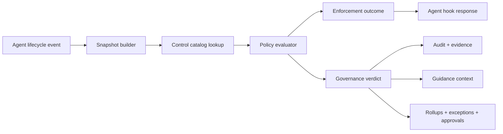

# COOD-34 Policy Governance Redesign

Status: draft design, 2026-08-09

Scope: redesign Coodra policy and permissioning so COOD-34 can operationalize the VXI Cloud IAM control catalog as non-blocking AI governance, while keeping existing hard safety controls for secrets and agent self-protection.

## Source Inputs

- COOD-34: "Operationalize VXI Cloud IAM Control Catalog as non-blocking policy guidance."
- Microsoft Agent Governance Toolkit, especially Agent Control Specification: lifecycle intervention points, deterministic policy runtime, evidence-bearing verdicts, tool catalog labels, annotators, approval configuration, and audit.
- Current Coodra implementation:
  - `packages/policy/src/types.ts`: runtime decision type is `allow | deny | ask`.
  - `packages/policy/src/policy.ts`: first-match-wins, tool-oriented evaluator, fail-open DB/cache fuse, async audit write helper.
  - `packages/db/src/schema/sqlite.ts`: policy catalog has versions, exceptions, decision audit fields, control metadata, and kill switches.
  - `packages/shared/src/policy-evaluators.ts`: UI-facing evaluator taxonomy already names lifecycle governance verbs, but storage collapses them.
  - `apps/hooks-bridge/src/handlers/pre-tool-use.ts`: only pre-tool calls are evaluated through DB policy.
  - `apps/hooks-bridge/src/handlers/config-change.ts`: config projection is attested separately from DB policy rules.
  - `packages/db/src/ensure-default-policy.ts`: fresh installs now soften `.git/**` and `node_modules/**` from `deny` to `ask`; `.env` and agent-control self-protection remain `deny`.

## Problem

Coodra currently has two ideas partially fused together:

1. Permissioning: synchronous enforcement at agent hook time, answering "may this agent perform this action?"
2. Governance: advisory controls, control ownership, evidence, review cadence, control status, and audit rollups.

That fusion makes the product feel too restrictive because advisory controls are forced into `allow | ask | deny`. Today the web UI exposes `record`, `flag`, `warn`, `block`, and `pass`, but `policyDecisionForStorage()` maps them into the enforcement triad. This means guidance can become interruption, and lifecycle/process controls can look like tool permissions even when no tool-call hook can prove them.

COOD-34 needs the opposite: governance controls must be visible and auditable without becoming gates.

## Design Principle

Split "can the agent continue?" from "what governance signal should be recorded?"

Every policy evaluation should return two independent outputs:

- Enforcement outcome: `allow`, `ask`, or `deny`.
- Governance verdict: `pass`, `record`, `advise`, `warn`, `escalate`, `block`, or `transform`.

Only the enforcement outcome may interrupt a tool call. Governance verdicts drive context, audit, evidence, dashboards, approvals, and follow-up work.

## Target Architecture

### 1. Control Catalog

Add a first-class control catalog instead of representing every governance item as a tool-call rule.

Suggested tables:

- `controls`
  - `id`, `org_id`, `control_id`, `domain`, `subdomain`, `title`, `description`, `priority`, `owner`, `frequency`, `source`, `status`, `track`, `created_at`, `updated_at`
  - `track`: `agent_observable | process_attested`
- `control_policy_links`
  - `id`, `control_id`, `policy_id`, `rule_id`, `intervention_point`, `created_at`
- `control_attestations`
  - `id`, `control_id`, `project_id`, `work_pack_id`, `status`, `evidence_uri`, `evidence_summary`, `attested_by_user_id`, `attested_at`, `valid_until`, `created_at`

This preserves COOD-34's two tracks:

- Track A, agent-observable controls: controls that can fire from hooks, e.g. destructive shell, cloud exposure, secret access, direct deploy.
- Track B, process controls: controls that need human or pipeline attestation, e.g. kickoff review, support model, access certification.

### 2. Policy Manifest Layer

Keep Coodra's DB as source of truth, but compile active policies into an internal manifest shape modeled after AGT/ACS:

- `intervention_point`: `session_start`, `user_prompt`, `pre_tool_call`, `post_tool_call`, `config_change`, `turn_end`, `session_end`
- `policy_target`: JSON-path-like selector over a normalized hook snapshot
- `tool_catalog`: per-tool metadata such as sensitivity, labels, clearance, integration owner
- `annotations`: host-computed labels such as `contains_secret`, `touches_iac`, `cloud_resource`, `prod_like`, `external_network`
- `approval`: where escalation requests are recorded and who can approve

Coodra does not need to adopt AGT's runtime directly. The important import is the contract shape: lifecycle-aware, evidence-bearing, and portable across agents.

### 3. Decision Model

Replace the single stored `decision` meaning with two fields.

Runtime enforcement:

- `allow`: continue without interruption.
- `ask`: agent/user must confirm before continuing.
- `deny`: block.

Governance verdict:

- `pass`: control checked and satisfied.
- `record`: store evidence only.
- `advise`: allow, inject guidance, record audit.
- `warn`: allow, visible warning, higher audit severity.
- `escalate`: allow or ask depending on configured approval mode, creates approval/evidence task.
- `block`: maps to enforcement `deny` only when `enforcement_mode = preventive`.
- `transform`: allow with host-owned mutation when an agent supports safe argument/output rewriting.

COOD-34 should use `advise`, `record`, and `warn` only. It must not emit blocking enforcement from VXI controls.

### 4. Enforcement Modes

Make mode explicit per policy, rule, and control:

- `detective`: evaluate, audit, never interrupt.
- `advisory`: evaluate, audit, inject guidance/warnings, never interrupt.
- `approval`: ask/escalate only when configured.
- `preventive`: can deny.
- `disabled`: ignored.

For compatibility, current `policies.enforcement_mode = detective` should finally become meaningful in the evaluator. Existing safety rules can be migrated as `preventive`; VXI controls as `advisory`.

### 5. Reusable Grants for Repeated Asks

Repeated prompts for materially identical work should become scoped, auditable grants. "Allow all" should exist only as a precise scope chosen by the user, not as an unbounded bypass.

Current Coodra state:

- `policy_decisions.ask_outcome` records whether a single prompted action was later approved.
- `policy_exceptions` can already override a decision to `allow`, `ask`, or `deny` with scopes such as `project`, `session`, `tool`, `path`, and `agent`.
- The missing layer is an explicit product flow that turns an approved ask into a bounded active exception/grant for future matching actions.

Add grant scopes:

- `once`: current behavior; approve only this tool invocation.
- `similar_task`: allow repeated calls with the same rule, tool, normalized command/path fingerprint, and work-pack/task context.
- `session`: allow matching calls in the current agent session only.
- `project`: allow matching calls in this project, with expiry and owner visibility.
- `repo`: allow matching calls in this repository checkout.
- `org`: admin-only; allow matching calls across projects in an org.

Do not expose a raw "allow all" action. Instead expose understandable labels:

- "Allow once"
- "Allow similar for this task"
- "Allow for this session"
- "Allow for this project"
- "Ask every time"

Implementation shape:

- Add `grant_scope`, `grant_fingerprint`, `grant_expires_at`, and `source_policy_decision_id` to exceptions, or add a `policy_grants` table that compiles into active exceptions.
- On an `ask` result, include a grant proposal in the hook output when the agent supports richer prompting; otherwise surface it in Coodra UI/CLI as a follow-up action.
- When execution proves approval (`PostToolUse` resolves `ask_outcome = approved`), keep the audit row and optionally create a grant only if the user chose a reusable scope.
- Match grants before ordinary ask rules, but after hard preventive deny rules.
- Always record the grant id as `matched_exception_id` / `matched_grant_id` on later allowed decisions.

Grant fingerprints should be conservative:

- Bash: normalized command family, not raw free-form command. Example: `git push --force` and target remote/branch if available.
- File edits: matched rule id + path glob + operation kind.
- MCP tools: server name + tool name + selected stable arguments, with secrets redacted.
- Work-pack/task: include `work_pack_id` when present so "similar task" does not silently bleed into unrelated work.

Safety rules:

- Secrets and self-protection controls cannot be granted away from an agent prompt. `.env` read/write, `.coodra/**`, agent hook/config files, and policy projection files stay preventive unless an admin creates a separate time-boxed exception in the policy UI.
- Project/org grants need expiry by default.
- Session grants expire at `SessionEnd` and should be swept or ignored after session close.
- Grants created from asks should never alter source policy rules; they are overlays with audit history.

This turns the decision model into a useful ladder:

- `ask + once`: interruption with no memory.
- `ask + similar_task`: remember narrowly.
- `ask + session`: remember for the active work session.
- `ask + project`: remember for this repo/project with expiry.
- `preventive + deny`: cannot be bypassed through normal prompt approval.

### 6. Hook Coverage

Evaluate policy at all lifecycle points Coodra already normalizes, not only `PreToolUse`.

First implementation wave:

- `PreToolUse`: enforcement plus advisory guidance.
- `ConfigChange`: evaluate config drift rules and attest projection.
- `Stop` / `SubagentStop`: completion gates produce `warn` or `block` depending on mode.
- `SessionStart`: inject active controls and overdue attestations.

Second wave:

- `UserPromptSubmit`: prompt-sensitive governance hints.
- `PostToolUse`: scan tool output labels/evidence.
- `SessionEnd`: roll up control evidence and run completeness.

### 7. Audit and Evidence

Extend `policy_decisions` or add `governance_decisions` so every evaluation stores:

- enforcement outcome
- governance verdict
- control id
- intervention point
- policy version id
- matched rule id
- matched exception id
- evidence JSON
- result labels
- approval/request id, if any
- grant id and grant scope, if a reusable approval was applied
- generated guidance text hash or short code

Do not store large raw tool inputs or secrets. Keep snapshots bounded and redacted.

### 8. UI Changes

Split the current `/policies` surface into three mental lanes:

- Controls: catalog, owner, frequency, status, evidence, overdue rollup.
- Rules: matcher/evaluator details that bind controls to lifecycle events.
- Decisions: audit trail showing enforcement outcome and governance verdict separately.
- Grants: active reusable approvals, scope, expiry, creator, source ask, and revoke action.

The add-rule form should prevent invalid combinations instead of storing them lossy. For example, `Config Drift + flag` should store `governance_verdict = flag`, `enforcement_decision = allow`, not `decision = ask`.

### 9. Migration Plan

1. Add typed enums and schema fields without changing behavior:
   - `policy_rules.governance_verdict`
   - `policy_rules.enforcement_decision`
   - `policy_rules.enforcement_mode`
   - `policy_decisions.governance_verdict`
   - `policy_decisions.evidence_json`
   - `policy_decisions.result_labels_json`
   - reusable grant fields or a new `policy_grants` table
2. Backfill existing rows:
   - stored `deny` -> `enforcement_decision=deny`, `governance_verdict=block`, `enforcement_mode=preventive`
   - stored `ask` -> `enforcement_decision=ask`, `governance_verdict=escalate`, `enforcement_mode=approval`
   - stored `allow` -> `enforcement_decision=allow`, `governance_verdict=pass`, `enforcement_mode=detective`
3. Update evaluator result type to return both outcomes.
4. Update hook shapers to enforce only `enforcement_decision`.
5. Add scoped grant creation, matching, expiry, and revocation.
6. Add Control Catalog tables and import VXI spreadsheet rows.
7. Reclassify the 66 VXI controls into Track A/Track B.
8. Add advisory guidance injection for Track A.
9. Add Track B attestation CLI/web action and dashboard rollup.
10. Only after data proves low false-positive rates, allow selected non-VXI controls to opt into approval or preventive mode.

## Default Posture

Recommended baseline:

- `.env` read/write: `preventive + deny`
- agent/Coodra control files: `preventive + deny`
- `.git/**` and `node_modules/**`: `approval + ask`
- targeted risky Bash: `approval + ask`
- VXI controls: `advisory + advise/warn/record`
- process controls: `detective + record`, with attestation cadence

This preserves safety where Coodra must be firm, while making governance helpful rather than obstructive.

## Implementation Slices

1. `COOD-34A`: schema and type split for enforcement vs governance verdict.
2. `COOD-34B`: evaluator returns dual outcome and honors `enforcement_mode`.
3. `COOD-34C`: hook shapers enforce only enforcement outcome; advisory guidance is context-only.
4. `COOD-34D`: reusable grants for once / similar task / session / project approvals.
5. `COOD-34E`: Control Catalog schema and VXI import.
6. `COOD-34F`: Track A advisory rules and audit evidence.
7. `COOD-34G`: Track B attestations and rollups.
8. `COOD-34H`: UI redesign for Controls / Rules / Decisions / Grants.

## Non-Goals

- Do not compile VXI controls into AWS/GCP/Azure IAM.
- Do not block releases from COOD-34 controls.
- Do not claim process controls are satisfied from tool-call observations alone.
- Do not depend on prompt instructions as a control surface.
