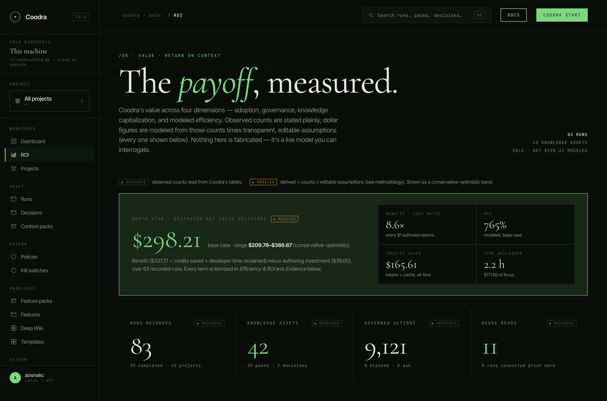
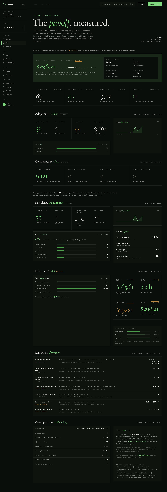

# Coodra — Return on Context

> **Stop letting AI code blind.**
>
> This is the honest value story behind Coodra: what it changes for an AI‑assisted
> engineering team — in time, money, knowledge, safety, integration, and teamwork —
> **measured** where we can measure, and **modeled transparently** where we can't.

---

## The problem: agents that start from zero, every time

An AI coding agent is brilliant for ten minutes and amnesiac forever. Every new
session it codes **blind**:

- It **re‑discovers your codebase** from scratch — scanning files, re‑reading the
  tree, re‑asking "how does this module work?" — burning thousands of tokens *per
  turn* before writing a useful line.
- It **forgets why decisions were made**, so it re‑litigates them, or silently
  contradicts them and you catch it in review.
- It **repeats blocked mistakes** — the same unsafe command, the same protected file.
- The **knowledge from each session evaporates** when the session ends. The next
  session, and the next teammate, start over.

The cost is real but invisible: credits burned on re‑discovery, developer hours lost
re‑explaining context, architectural drift, and the occasional runaway loop that
quietly spends a hundred dollars of API budget before anyone notices.

---

## What Coodra does — three pillars

| Pillar | What it is | What it kills |
|---|---|---|
| **Feature Pack** | The architectural blueprint of a module, injected at session start. | Blind re‑discovery. The agent starts *informed*. |
| **Context Pack** | A durable record of what was built and decided. | Amnesia. The next session *resumes* instead of restarting. |
| **Policy** | Every agent action checked before it runs. | Unsafe writes and runaway loops — stopped before they cost you. |

Around those: **MCP‑native** (works with Claude Code, Cursor, Windsurf, Codex), a
**local‑first store** (your code's history never has to leave your machine), and
**optional team sync**.

---

## How we talk about value: **measured vs. modeled**

This is the load‑bearing rule, and it's printed on every screen:

- **● Measured** — real counts from Coodra's own tables: runs, tool calls, governed
  actions, decisions, context packs, reuse reads. **These are facts.**
- **◐ Modeled** — dollar and token figures *derived* from those counts × transparent,
  cited, editable assumptions, always shown as a **conservative–base–optimistic band**
  and badged "modeled."

No token meter exists in the agent ecosystem — Claude Code's hooks don't expose token
usage — so **we never pretend to measure tokens.** We model them, show the formula
next to the number, and let you change the assumptions and watch every figure move.
This is the opposite of "trust us, we save you money": every dollar traces back to a
count you can verify and a constant you can edit.

---

## The dashboard

Open `/roi` in the web app, or run `coodra roi` in the terminal — **identical math,
identical numbers** (both consume the same `@coodra/shared/roi` model).



The north star is a single modeled number — **net value delivered** — shown as a band,
with the benefit/cost ratio and ROI beside it. Below it, four dimensions tell the whole
story, every measured count stated plainly and every modeled dollar itemized.



---

## Dimension 1 — **Time reclaimed**

The most expensive thing an agent wastes isn't tokens — it's a developer's attention.

- **Onboarding collapses.** Instead of an agent (or a new teammate) spending the first
  half‑hour of every task re‑deriving how a module works, the Feature Pack hands it the
  blueprint at second zero.
- **Re‑derivation disappears.** When the agent recalls a prior decision or context pack
  instead of reasoning it out again, that's a *reuse read* — a measured event. Each one
  is an avoided detour. We value it at the programmer‑specific interruption‑recovery
  cost (**Parnin & Rugaber: 10–15 minutes to resume an interrupted task**), priced at a
  fully‑loaded developer rate.
- **Fewer correction loops.** Accurate cross‑session memory means the human stops typing
  "no, we decided X" — the cognitive‑interruption tax the dashboard's time figure
  captures.

*Measured:* reuse reads, runs that consulted prior work (the **KCS Link Rate**, target
60–80%). *Modeled:* hours reclaimed = reuse reads × 12 min ÷ 60 × $78/hr.

---

## Dimension 2 — **Money / credits saved**

Four levers, each priced at the published Anthropic rate card, each itemized on the
dashboard's *Efficiency & ROI* panel:

| Lever | What it captures | Modeled formula (base) |
|---|---|---|
| **Context compression** | A focused ~4k‑token pack instead of ~12k tokens of blind re‑discovery, every session. | `runs × (12,000 − 4,000) tok` |
| **Prompt cache** | The stable injected prefix is paid once, then re‑read each turn at the 0.1× cache rate instead of full input price. | `cached turns × 4,000 × 0.9 − write premium` |
| **Knowledge reuse** | Recalling prior knowledge instead of re‑deriving it from scratch. | `reuse reads × 6,000 tok` |
| **Runaway‑loop prevention** | Tokens a blocked unsafe/runaway action would have burned before a human noticed. | `blocks × 40,000 tok` |

Tokens are converted to dollars at the model's input rate (Opus: **$5 / million
tokens**; cache‑read 0.1×, cache‑write 1.25×). The defaults are deliberately
**conservative** so the headline under‑promises.

---

## Dimension 3 — **Knowledge that compounds**

Every decision recorded and every context pack saved is an **asset that appreciates**.
The first time the agent documents a decision it costs ~6 minutes; every later session
that recalls it pays nothing and avoids a re‑debate.

- **Knowledge captured** — a measured corpus of decision + pack text (shown as an
  estimated token count, chars ÷ 4).
- **Decision quality** — what fraction of decisions carry a rationale, an alternative,
  and a confidence (the **DIQ** completeness signal).
- **Graph density** — context packs that link the decisions they implement.
- **Freshness & bus‑factor** — average asset age, stale‑share (>90d), and author
  concentration, so the knowledge base stays trustworthy and isn't one person's head.

Unlike tokens, this asset **does not reset** at the end of a session. It is the
difference between a team that gets faster every month and one that re‑learns its own
codebase forever.

---

## Dimension 4 — **Governance & safety**

Coodra treats each AI agent as a **non‑human identity** and checks every action before
it runs.

- **Coverage, not just incidents.** Every write, every shell command, passes through the
  policy engine — measured as *governed actions*. That coverage is the value even when
  nothing is blocked: the enforcement layer is armed and watching.
- **Blocks prevent disasters.** A blocked write to `.github/workflows/`, a halted
  five‑loop retry — each one a prevented credit spike or a prevented manual cleanup. The
  model values a runaway block at the ~40k tokens it would have burned **plus** ~15
  minutes of avoided git‑reset.
- **Kill switches** pause a misbehaving agent instantly; **audit trails** make every
  decision reviewable.

This is access governance for AI agents — not just context injection.

---

## Integration — meets your agents where they already are

Coodra doesn't ask you to adopt a new IDE or rewrite your workflow. It wires into the
tools you run:

- **MCP‑native** — one server, 20 tools, consumed by Claude Code, Cursor, Windsurf, and
  Codex alike. A hooks bridge adds zero‑effort Feature‑Pack injection and Context‑Pack
  capture on Claude Code and Cursor.
- **Jira (via Atlassian's Rovo MCP)** — Coodra doesn't rebuild a Jira client; it wires
  Atlassian's own MCP and adds the leverage: **link a run to an issue** so history
  becomes ticket‑aware ("what work touched PROJ‑412?"), and **post the session summary
  back to the ticket** on request.
- **Graphify (via its MCP)** — live codebase‑graph queries for blast‑radius and
  "where is X defined?" before a refactor.
- **Deep Wiki** — an agent‑authored, hierarchical, mind‑map explanation of the codebase,
  rendered in the web app.

The pattern throughout: **wire the best external tool, don't reinvent it** — and add the
durable record and the cross‑session leverage on top.

---

## Seamless teamwork

What one developer captures, the whole team inherits — automatically.

- **Local‑first, cloud‑synced.** Runs, decisions, and packs are written to a local
  SQLite store first (sub‑millisecond, offline‑safe, your data stays on your machine in
  solo mode), then mirrored to a shared Postgres in team mode. The #1 enterprise blocker
  — "our code's history leaves the building" — is gone by default.
- **Shared memory.** A decision recorded on one laptop is injected into a teammate's
  next session. The architecture stops drifting because everyone's agent reads the same
  blueprint.
- **One‑click onboarding.** `coodra invite <email>` produces a single signed URL; the
  teammate is in, authenticated, and synced in seconds.
- **Role‑based access.** Admin / member / viewer roles, enforced at the server boundary,
  with an append‑only audit trail — so a PM or auditor can *see* everything and *author*
  nothing.

The compounding effect is the point: the knowledge base a team builds in month one makes
every agent on the team faster in month two.

---

## The model, in full (auditable)

Nothing here is hidden. These are the default constants (all editable); the dashboard's
*Evidence* panel prints the literal `value = count × constant` derivation for every
modeled number.

| Assumption | Default | Source |
|---|---|---|
| Model rate card (Opus) | $5 in · $0.50 cache‑read · $6.25 cache‑write / MTok | Anthropic published pricing |
| Blind re‑discovery / session | 12,000 tokens | Estimate (Cursor smart‑context ~10–15k/turn) |
| Injected pack prefix | 4,000 tokens | Coodra pack size |
| Re‑derivation avoided / reuse | 6,000 tokens | Estimate — tune per repo |
| Runaway tokens / block | 40,000 tokens | Estimate |
| Minutes reclaimed / reuse · / block | 12 · 15 | Parnin & Rugaber (10–15 min to resume) |
| Blended developer rate | $78 / hour | DX (getDX), ≈ $150k/yr fully loaded |
| Effort to author one asset | 6 minutes | Estimate |
| Scenario band | ×0.5 / ×1.0 / ×1.5 on benefit‑side levers | Forrester TEI risk‑adjusted banding |

> **Honesty note.** The prompt‑cache lever is the largest single term in the model and
> is the most assumption‑heavy (it treats recorded tool calls as a proxy for cached
> turns). We surface it as exactly that — a modeled estimate with an editable assumption
> — never as a measured fact. Lower the rate card or the turn assumption and the headline
> moves accordingly. That's the point of an auditable model.

---

## A worked example — a 10‑developer team, one month

*Illustrative inputs (your numbers go here): 10 devs × 4 sessions/day × 20 days = **800
runs**; ~15 turns/run = **12,000 tool calls**; ~1.5 knowledge reuses/run = **1,200 reuse
reads**; **12** runaway blocks; **150** assets authored.* Run through the base model:

| | Conservative | **Base** | Optimistic |
|---|---:|---:|---:|
| Credits saved (direct API $) | $225 | **$268** | $311 |
| Developer time reclaimed | 122 h → $9,477 | **243 h → $18,954** | 365 h → $28,431 |
| Authoring investment (cost) | −$1,170 | **−$1,170** | −$1,170 |
| **Net value / month** | **≈ $8,500** | **≈ $18,050** | **≈ $27,600** |
| Benefit‑cost ratio | 8.3× | **16.4×** | 24.6× |

Two honest readings of that table:

1. **Credits saved is hard cash** — a few hundred dollars of API spend avoided per month
   for a small team, growing with usage. Modest but real and recurring.
2. **Time reclaimed is the headline, and it's opportunity value, not an invoice** — it
   depends entirely on how often the agent actually consults prior work and what you
   value an engineer‑hour at. Even halve every assumption (the conservative column) and
   the program is strongly net‑positive in month one. *These are modeled estimates with
   the band shown precisely so you can argue with them — change the inputs and recompute.*

---

## What we measured on one real machine

To prove the dashboard runs on real data — not a demo seed — here are the **measured**
counts from a single developer's local instance, and the **modeled** rollup the same
machine produced (badged accordingly):

**Measured (facts):** 83 runs across 45 projects · 39 completed · 9,100 recorded tool
calls · **9,117 governed actions** (0 blocked, 0 ask) · 39 context packs (3 agent‑authored,
36 auto) · 2 decisions · 1 Feature Pack · 42 wiki pages · 11 knowledge‑reuse reads ·
~16,100 tokens of captured knowledge.

**Modeled (estimates, base case):** ~33.1M tokens of work avoided → **$165 credits
saved**, **2.2 hours reclaimed**, against **$39** of authoring investment → **net ≈ $298**
(band $210–$387), **benefit‑cost ratio 8.6×**, **ROI 764%**.

> This is one developer's solo usage. The team example above is what the same model
> projects when a team adopts the reuse contract. Reuse, blocks, and per‑turn output are
> "capture armed" until agents follow the trigger contract — shown honestly as zero until
> the events actually land, never back‑filled.

---

## What we **don't** claim

- We don't claim a measured token meter — there isn't one; we model and show our work.
- We don't claim value before it's earned — reuse and block counts read **zero** until
  the events actually happen.
- We don't present a tight band as certainty — the conservative–optimistic spread is
  shown on every modeled figure.

Honesty is the product. A value dashboard you can't audit is just marketing; this one
hands you the formula and the editable assumption next to every number.

---

## Get started

```bash
npm i -g @coodra/cli@beta
coodra init          # register the project, wire the agent
coodra start         # local MCP server + hooks bridge + web dashboard
coodra roi           # see your return on context, any time
```

Then open the **`/roi`** dashboard, or share it. **Stop letting AI code blind.**
